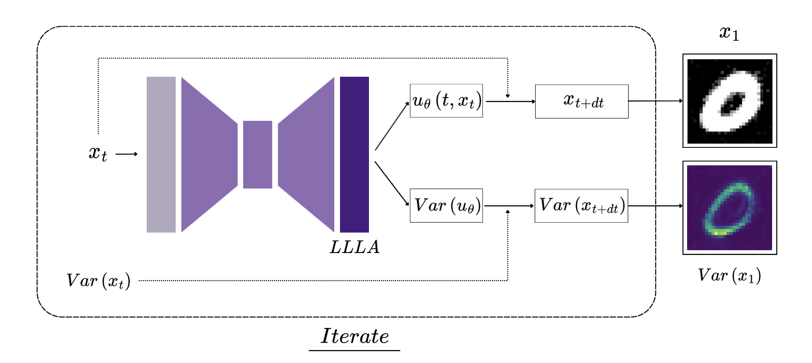

## BayesFlow: Extension of BayesDiff to Flow matching

# Overview



This project introduces BayesFlow, an approach for estimating pixel-wise uncertainty in generated images, extending the principles of BayesDiff, presented in the paper "BayesDiff: Estimating Pixel-wise Uncertainty in Diffusion via Bayesian Inference" to the more efficient Flow Matching generative models. We leverage the Last Layer Laplace Approximation to quantify uncertainty during the generative process, providing nice and interpretable uncertainty maps. Our experiments demonstrate the effectiveness of BayesFlow on widely used datasets such as MNIST and Fashion-MNIST.

## Key Features

- **BayesDiff Extension:** Adapts the Bayesian inference framework of BayesDiff from Diffusion Models to Flow Matching.

- **Pixel-wise Uncertainty Estimation:** Computes detailed relative uncertainty maps for every pixel in generated images using the Last Layer Laplace Approximation.

- **Flow Matching Extension:** Implements a Flow Matching generative model, known for its computational efficiency and coherent interpretability.

- **Flexible Uncertainty Calculation:** The uncertainty computation code is designed to work seamlessly with both newly trained and existing pretrained models.

- **Dual Implementations:** Includes implementations for both Flow Matching and Diffusion models for comparative analysis.

## Why Flow Matching for Uncertainty?

Flow Matching models offer significant advantages for uncertainty quantification in generative processes compared to traditional diffusion models, like:

- **Computational Efficiency:** Flow Matching typically requires fewer generation steps than Diffusion models and avoids stochastic processes, leading to faster inference.

- **Coherent Interpretation:** Flow models naturally integrate with Bayesian uncertainty estimates. The propagation of uncertainty within flow models is more explicit and better structured, providing clearer insights.

- **Strong Empirical Performance:** Recent state-of-the-art models like SD3 and Flux leverage Flow Matching, demonstrating highly competitive results in image generation.

## Methodology Overview

Our approach centers on extending uncertainty estimation to Flow Matching models.

- **Flow Matching Base**: We utilize a Flow Matching model using a U-Net architecture.

- **LLLA**: To quantify uncertainty, we apply LLLA to the last layer parameters (theta) of the U-Net architecture. This allows us to estimate the uncertainty in the model's prediction of the velocity field.

- **Uncertainty Propagation**: The core idea is to propagate the variance of this prediction along the generative process. We simulate the ODE that defines the flow using the Euler Method. Crucially, the uncertainty at each step accumulates from the previous state's uncertainty and the uncertainty in the predicted velocity field.

- **Pixel-wise Uncertainty Maps**: This iterative process allows us to obtain a pixel-wise uncertainty map $diag(Var(x_1))$ for the final generated image, indicating areas where the model is more or less confident.

## Experiments & Results

We conducted experiments on the MNIST and Fashion-MNIST datasets to evaluate BayesFlow. Our findings demonstrate the ability to generate coherent pixel-wise uncertainty maps for both datasets. Visual comparisons highlight the differences in uncertainty behavior between Flow Matching and Diffusion models, providing insights into the benefits of our approach. The sum of pixel uncertainties over time further illustrates these distinctions across methods.

[Training Runs Report](https://api.wandb.ai/links/jac-zac/h0ack55v)

## 🧪 Running the Project

- Create the virtual environment

```bash
 python3.12 -m venv .venv
```

- Activate the environment

```bash
source .venv/bin/activate
```

- Install dependencies

```bash
pip install -r requirements.txt
```

- Train the model
  > From the root of the directory

The following is just an example to get all options you can run: `python -m src.train.run --help`

```bash
python -m src.train.run --epochs 20 --method=diffusion
```

This will log results to wanbd if enabled. Keep in mind that you have to add your api key inside a `.env` file in the root of the repo. You can take inspiration from `.env_sample`

- You can also run a model to generate images:
  > The following is an example which use the best_model checkpoint to generate images inside the checkpoint directory by default

```bash
python -m src.eval.generate --n 10
```

### To get all the plots

> You first need to train the model and then run the general script

```bash
./generate_llla_samples.sh
```

### Project Structure

```bash
.
├── notebooks # Notebooks for experiments
│   ├── notebook_llla_diff.ipynb
│   ├── notebook_llla_flow.ipynb
│   ├── notebook_train_diff.ipynb
│   └── notebook_train_flow.ipynb
├── src # Main part of the code
│   ├── eval
│   │   ├── generate.py
│   │   └── llla.py # Code to perform llla fit and make plots with it
│   ├── models
│   │   ├── __init__.py
│   │   ├── diffusion.py
│   │   ├── flow.py
│   │   ├── llla_model.py # Wrapper of the unet with LLLA
│   │   └── unet.py
│   ├── train # Train code for Flow/Diff on MNIST/Fashion-MNIST
│   │   ├── __init__.py
│   │   ├── run.py
│   │   └── train.py
│   ├── utils # Utilities for model training logging, loading and plots
│   │   ├── __init__.py
│   │   ├── data.py
│   │   ├── environment.py
│   │   ├── plots.py
│   │   └── wandb.py
│   └── __init__.py
├── generate_llla_samples.sh # Script to generate plots
├── notes.md # Additional Notes
├── README.md
└── requirements.txt
```

## References

- _Kou, S., Gan, L., Wang, D., Li, C., & Deng, Z. (2023). BayesDiff: Estimating Pixel-wise Uncertainty in Diffusion via Bayesian Inference. arXiv:2310.11142_

- _Daxberger, E., Kristiadi, A., Immer, A., Eschenhagen, R., Bauer, M., & Hennig, P. (2022). Laplace Redux -- Effortless Bayesian Deep Learning. arXiv:2106.14806_

- _Lipman, Y., Havasi, M., Holderrieth, P., Shaul, N., Le, M., Karrer, B., Chen, R. T. Q., Lopez-Paz, D., Ben-Hamu, H., & Gat, I. (2024). Flow Matching Guide and Code. arXiv:2412.06264_

- _Kristiadi, A., Hein, M., & Hennig, P. (2020). Being Bayesian, Even Just a Bit, Fixes Overconfidence in ReLU Networks [Conference presentation]. arXiv:2002.10118_
